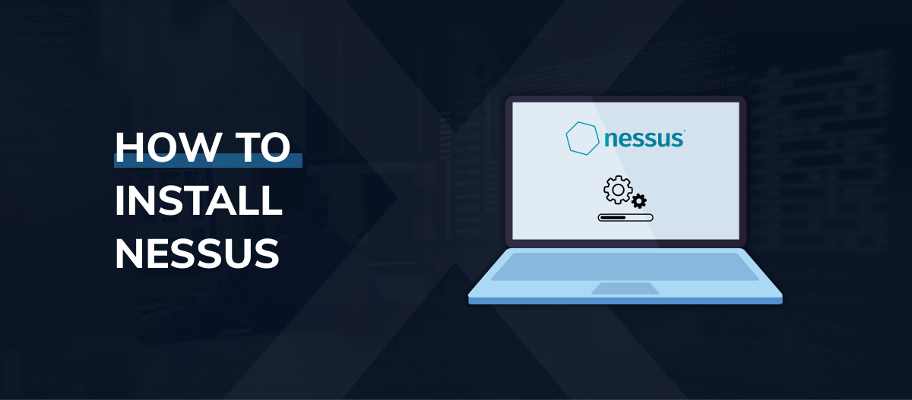

<h2>How-to-Install-Nessus-on-Kali-Linux</h2>

To find vulnerabilities in systems or networks using the Nessus vulnerability scanner, you first need to understand how to install it.

In this step-by-step tutorial, we’ll briefly discuss Nessus and then show you how to download, install, and start it on  Kali.

<h2>What Is Nessus?</h2>
Nessus is a robust tool by Tenable that can scan for vulnerabilities in networks, operating systems, databases, and applications.

It provides detailed reports on security weaknesses and prioritizes them based on severity.

<h3>How to Install Nessus on Kali Linux</h3>
This section will walk you through downloading, installing, and starting Nessus Essentials in Kali Linux.

<h3>Nessus Download</h3>

To download Nessus, visit the  <a href="https://www.tenable.com/downloads/nessus">Download page</a>  and select the Linux-Debian-amd64 file.

Then, select <b>“Download”</b> to download the file to <b>Kali.</b> 

<h3>Nessus Installation</h3>

To install Nessus, simply enter the following command in the terminal, 

type <b>ls</b> the press <b>ENTER</b>
now let's go into your download directory by pressing <b>cd</b> space <b>Downloads</b> then press <b>ENTER</b>
type <b>ls</b> again, then press <b>ENTER</b>

Now run this command

sudo dpkg -i <b>N</b> press the <b>TAB button</b> on your keyboard then Press <b>ENTER</b?

To begin installing, the plugins is needed before you can use Nessus, 
enter  <b>systemctl status nessusd</b> in the command line.

if it says <b>Disable</b> press <b>ENTER</b>
then type <b>systemctl start nessusd</b> in the command line then press <b>ENTER</b>

systemctl status nessusd</b> in the command line.
You will see <b>ACTIVE</b>
