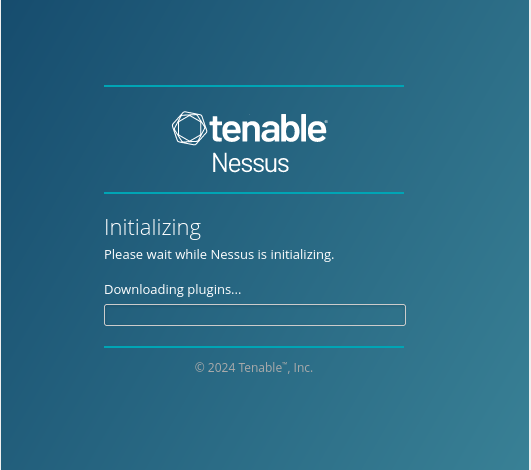

<h2>How-to-Install-Nessus-on-Kali-Linux</h2>

To find vulnerabilities in systems or networks using the Nessus vulnerability scanner, you first need to understand how to install it.

In this step-by-step tutorial, we’ll briefly discuss Nessus and then show you how to download, install, and start it on  Kali.

<h2>What Is Nessus?</h2>
Nessus is a robust tool by Tenable that can scan for vulnerabilities in networks, operating systems, databases, and applications.

It provides detailed reports on security weaknesses and prioritizes them based on severity.

<h3>How to Install Nessus on Kali Linux</h3>
This section will walk you through downloading, installing, and starting Nessus Essentials in Kali Linux.

<h3>Nessus Download</h3>

To download Nessus, visit the  <a href="https://www.tenable.com/downloads/nessus">Download page</a>  and select the Linux-Debian-amd64 file.

Then, select <b>“Download”</b> to download the file to <b>Kali.</b> 

<h3>Nessus Installation</h3>

To install Nessus, simply enter the following command in the terminal, 

type <b>ls</b> the press <b>ENTER</b>
now let's go into your download directory by pressing <b>cd</b> space <b>Downloads</b> then press <b>ENTER</b>
type <b>ls</b> again, then press <b>ENTER</b>

Now run this command

sudo dpkg -i <b>N</b> press the <b>TAB button</b> on your keyboard then Press <b>ENTER</b>

To begin installing, the plugins is needed before you can use Nessus, 
enter  <b>systemctl status nessusd</b> in the command line.

if it says <b>Disable</b> press <b>ENTER</b>

then type.... <b>systemctl start nessusd</b> in the command line then press <b>ENTER</b>

Now enter this again enter  <b>systemctl status nessusd</b> in the command line.
You will see <b>ACTIVE</b>

After starting the service, <b>go to</b> https://kali:8834/ in your web browser to access and configure Nessus.

When you try to access the URL, you'll see a warning message. Click on “Advanced…” and select “Accept the Risk and Continue.”

Next, you’ll be presented with a Nessus welcome screen. Click on “Continue” to move forward.

Select “Register for Nessus Essentials” on the following screen and click on “Continue.”

On the next screen, provide your name and email address and click on “Register” to continue.

On the next screen, you’ll be presented with an activation code. Copy and save this code somewhere for future reference. Click on “Continue.”

On the next screen, you must create a Nessus administrator user account, which will be used to login to Nessus.

Nessus will now begin downloading the plugins.

Once finished, you’ll be taken to the Nessus dashboard.

From here, Nessus will start configuring the plugins, which will take a while to complete. So grab a cup of coffee and relax while it works its magic.

Once finished, you’re ready to use Nessus.

<h2>Starting Nessus</h2>
To start Nessus, use the command sudo systemctl start nessusd.service and then open https://kali:8834/ in your browser.

You’ll need to log in with the credentials you set earlier.

Once you’re logged in, you can begin to use Nessus.

Once you are finished working with Nessus, you can stop the service with the command <b>sudo systemctl stop nessusd</b>

In the next tutorial, we’ll show you how to use Nessus in Kali.

peace: &#x1f54a;

